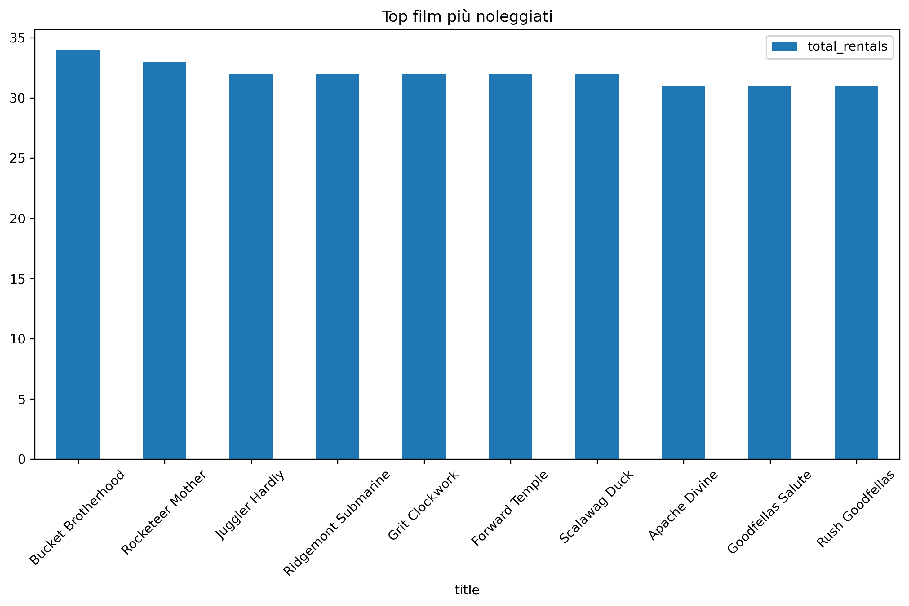
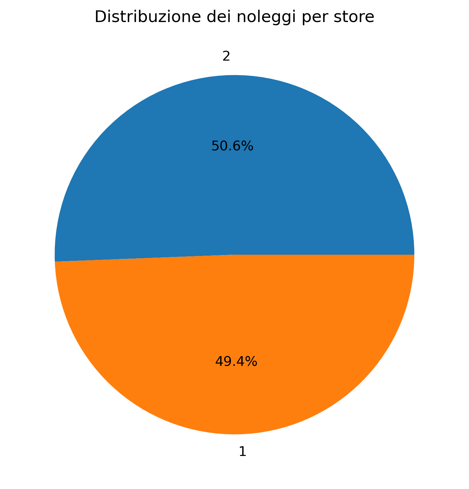
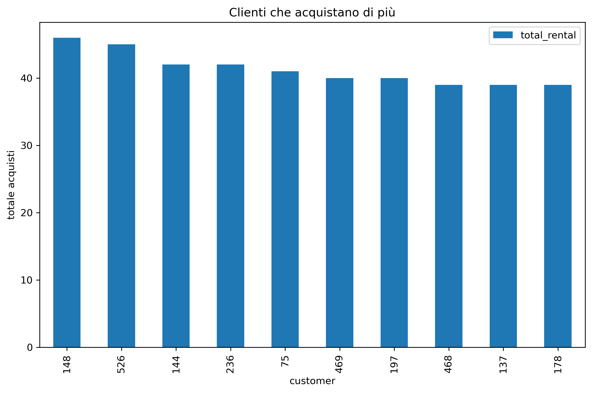
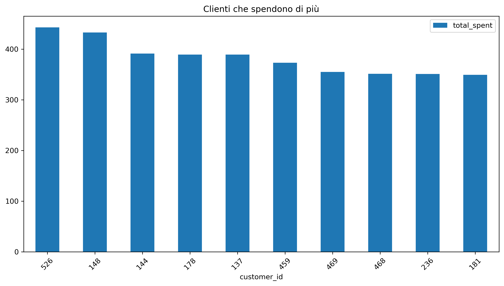
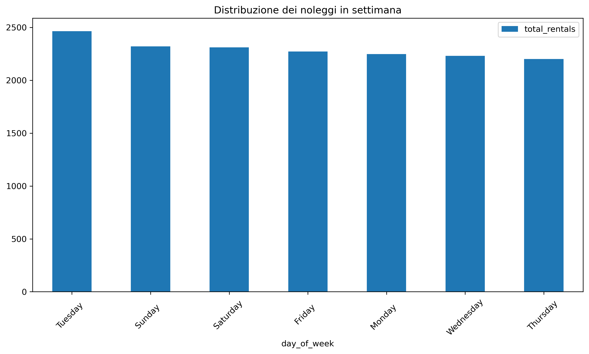
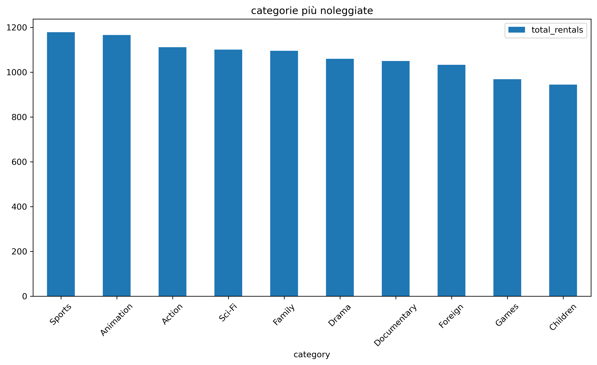

1. Project objective

Evaluate the quality of Pagila database data and apply professional checks to:

• referential integrity

• temporal coherence

• validity of values

• completeness

• uniqueness

• formatting of text fields

The goal is to demonstrate a data cleaning workflow that can be replicated in real-world contexts.

2. Methodology

For each table, checks were performed on:

• Primary Key (uniqueness, not null)

• Foreign Key (consistency between tables)

• NULL values

• Number ranges

• Temporal coherence

• Logical duplicates

• Text formatting

• Semantic anomalies (business logic)

Each check was documented with SQL queries and results.

3. Main results

Table: film

Checks performed:

• Valid PK

• No NULL value

• Consistent ratings (G, PG, PG-13, R, NC-17 only)

• No suspicious duplicates

• Clean up texts with trim() and initcap()

Outcome: consistent and comprehensive table.

Table: inventory
Checks performed:

• film_id → all valid

• store_id → all valid

• No NULL

• No abnormal duplicates

Outcome: perfectly consistent table.

Table: rental

Checks performed:

• return_date >= rental_date → OK

• No date reversed

• return_date = NULL → legitimate cases (unreturned movies)

• No rentals with abnormal duration (> 60 days)

• No NULL value not expected

Outcome: consistent table with no logical anomalies.

Table: payment

Checks performed:

• No negative amounts

• No out-of-range amounts

• amount = 0 → all associated with valid rents (freebies/discounts)

• No payment before rental

• No payments without customer or staff
Outcome: comprehensive and consistent table.

Table: staff

Checks performed:

• valid store_id

• valid address_id

• active = true for all (consistent with the dataset)

• No duplicates

Outcome: clean table.

Table: shop

Checks performed:

• valid_id_address

• valid manager_staff_id

Outcome: consistent table.

Table: customer

Checks performed:

• valid_id_address

• valid store_id

• Duplicate emails from Nessuna

• active coherent

Outcome: clean table.

Tables: address, city, country

Checks performed:

• valid city_id

• valid country_id

• No critical NULL value

Outcome: consistent tables.
4. Conclusions

The Pagila database has very high data quality, as predicted by a dataset

didactic. However, the project demonstrates:

• a complete data quality workflow

• ability to identify and evaluate anomalies

• ability to document complex controls

• mastery of SQL for cleaning and validation

• professional approach replicable on real datasets

This report is suitable for the portfolio because it shows method, rigor and skills, even if the dataset is clean.

6. Data Analysis (Data Analysis)

After checking the quality of the Pagila database, I performed a series of analyses to better

understand customer behavior, store performance, and movie popularity.

The analyses were performed using SQL queries and visualized with Python (pandas + matplotlib).

6.1 Top 10 Most Rented Movies

This analysis identifies the most popular films in the catalog.

Result: The most rented films show a strong concentration on a few titles.

Graph:

6.2 Distribution of rentals by store

The Pagila database contains only two stores, so the most effective visualization is a pie chart.

Result: The two stores have a very similar rental volume.

Graph:

6.3 Customers who rent more

Identify the most active customers in terms of the number of rentals.

Result: Some customers show a significantly higher than average rental frequency.

Graph:

6.4 Customers who spend more

Analysis of the economic value generated by customers.

Result: Top spender customers don't always match those who rent more.

Graph:

6.5 Average rental duration

Result: The average rental duration is about 5 days.

6.6 Distribution of rentals during the week

Weekly pattern analysis.

Result: Distribution is constant throughout the week, with:
    • a small peak on Tuesdays
    • a slight decrease on Thursdays
Graph:

6.7 Most rented movie categories
Genre popularity analysis.
Result: The most popular categories are:
    • Sports
    • Animation
Graph:

7. Conclusion of the analysis
Analysis of the Pagila database shows:
    • a strong concentration of rentals on a few films
    • a balanced distribution between the two stores
    • customers with very different behaviors (frequency vs. spending)
    • a stable average rental duration
    • regular weekly patterns
    • categories “Sports” and “Animation” as the most requested
This project combines:
 • data cleaning
    • Advanced SQL
    • data analysis
    • views
    • interpretation of the results

